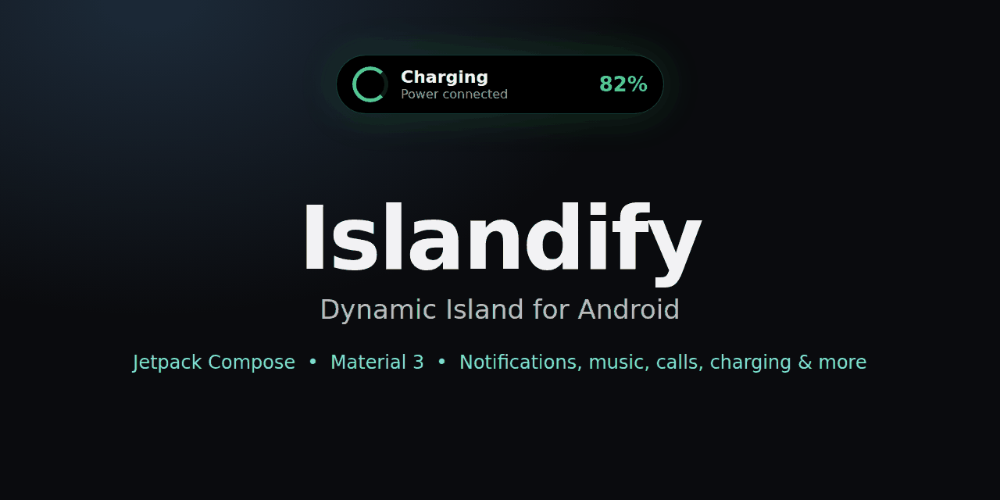
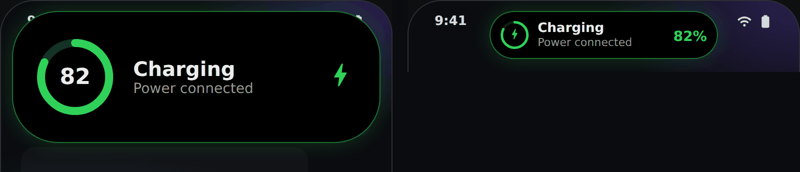
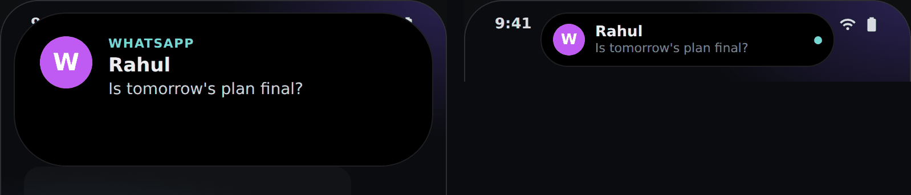
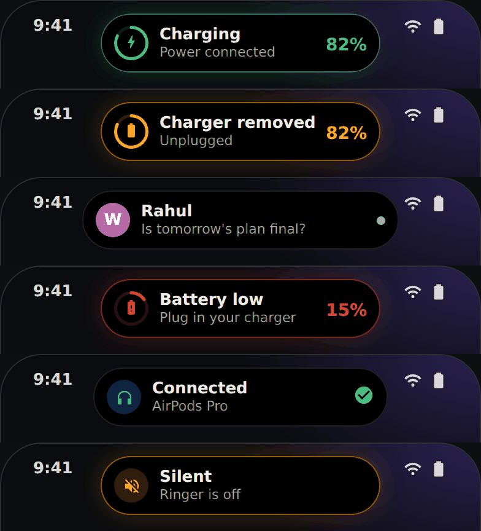

<p align="center">
  
</p>

# Islandify

**Dynamic Island for Android.** A small black pill at the top of your screen that turns into a card for notifications, music, calls, charging, timers, navigation and more. Built with Kotlin, Jetpack Compose and Material 3.

> Package: `com.islandify.app` | Version 1.0 | Android 8.0+ (API 26)

## What it shows

| Activity | What happens |
|---|---|
| Notifications | Messages and alerts pop up on the island. Inline **Reply** and **Mark as read** work from the card. |
| Music and media | Album art, waveform, play / pause / next / previous and a seek bar. |
| Calls | Incoming and ongoing calls, with **Answer** and **Decline**. |
| Charging | A battery banner when you plug in or unplug the charger. |
| Timer | Countdown for the in-app timer and for the Clock app timer. |
| Bluetooth and headphones | Shows the earbuds name when they connect. |
| Low battery | Warning at 20% and 10% while not charging. |
| Silent, DND, flashlight | A quick banner when these change. |
| Navigation | Live directions from Google Maps, Waze and OsmAnd. |
| Delivery and rides | Live order and ride status from Zomato, Swiggy, Uber and similar apps. |

Every activity can be turned on or off, and notifications can be blocked per app from the **Apps** tab.

## Compact banner for quick pop-ups

Charging, notification, earbuds, low battery and silent / flashlight pop-ups now appear as a slim **228-258 x 48 dp banner** instead of the big 368 x 132 dp card. Tap the banner to open the full card, long-press for the large card.

<p align="center">
  
</p>
<p align="center">
  
</p>
<p align="center">
  
</p>

*These images are design previews of the layout. Real device screenshots can be added to `docs/images/`.*

## Gestures

| Gesture | Action |
|---|---|
| Tap | Expand the pill or banner into a card. |
| Tap the card | Open the app the music or notification came from. |
| Long-press | Large mode. |
| Swipe left / right | Next / previous track. |
| Swipe up | Collapse, then hide the island. |

## Customize

Shape presets, width, height and roundness, animation speed, accent glow, haptics, position and camera cut-out calibration, auto-collapse time, idle pill, app theme (System, Light, Dark, AMOLED), Material You wallpaper colors or a custom accent color. The app is available in **English and Hindi**.

## Install

1. Download the latest APK from the [Releases](../../releases) page and install it.
2. Open Islandify and grant the permissions in the setup screen:
   - **Accessibility service** draws the island above the status bar so taps work. It does not read your screen.
   - **Notification access** lets the island see messages, calls and music.
   - **Show notifications** for the small "Islandify is running" notification that keeps it alive.
   - **Nearby devices (Bluetooth)** is optional, for earbud names.
   - **Battery: no restrictions** stops the system from closing the island.
3. If a switch is greyed out: *App info > three-dot menu > Allow restricted settings*.

### If the island keeps stopping
Some phones (Xiaomi, Oppo, Vivo, Realme, Samsung) kill background apps. Set battery to *No restrictions*, turn Autostart on (Xiaomi / Oppo / Vivo) and lock Islandify in the recent apps screen.

## Build from source

Requirements: JDK 17, Android SDK 35.

```bash
git clone https://github.com/bughunter11/Islandify.git
cd Islandify
./gradlew assembleRelease
```

The APK is created in `app/build/outputs/apk/release/`. The release build is signed with the debug key so it installs without a keystore. Use the release build for real speed, debug builds are much slower in Compose.

## Tech stack

- Kotlin 2.0, Jetpack Compose (BOM 2025.05.01), Material 3
- [material-kolor](https://github.com/jordond/MaterialKolor) for HCT color palettes from a seed color
- AndroidX Core, Activity, Lifecycle, SplashScreen, ProfileInstaller
- Kotlin Coroutines and StateFlow

## Privacy

Everything runs on your device. Islandify does not request the Internet permission, so it cannot send your notifications or any other data anywhere.

## Contributing

Issues and pull requests are welcome. If you change the UI, please add a screenshot to `docs/images/`.

## License

MIT, see [LICENSE](LICENSE).
